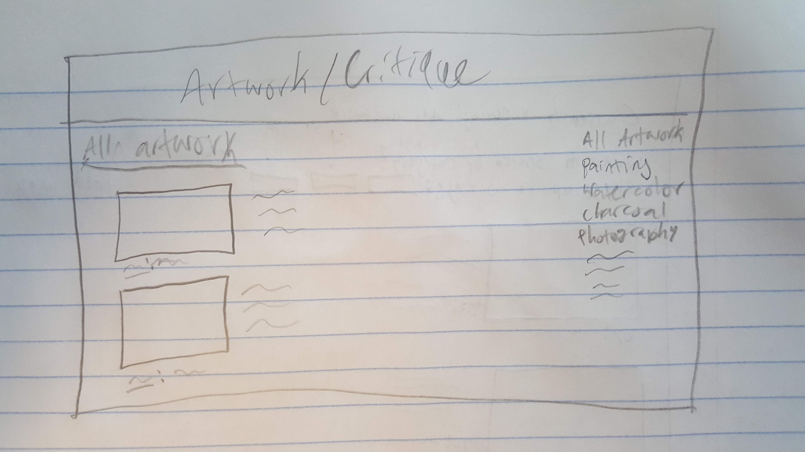
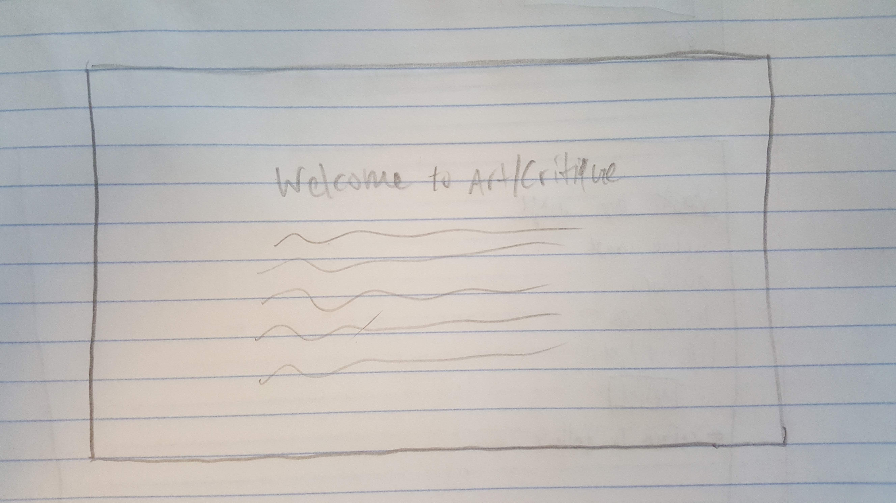
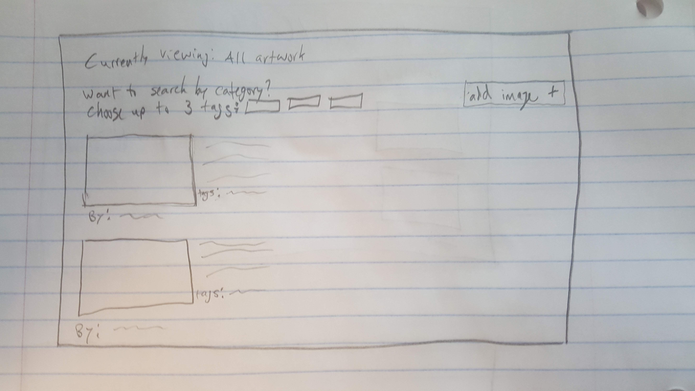
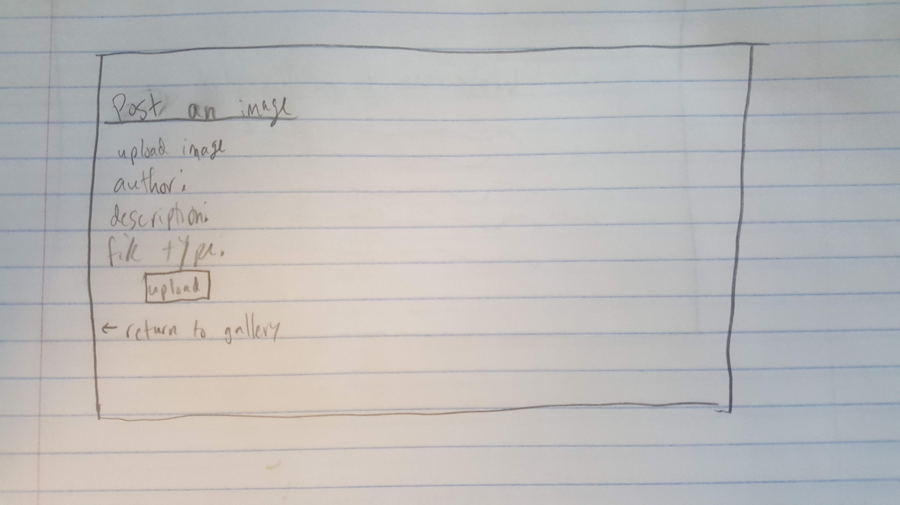

# Project 3: Design Journey

Be clear and concise in your writing. Bullets points are encouraged.

**Everything, including images, must be visible in VS Code's Markdown Preview.** If it's not visible in Markdown Preview, then we won't grade it.

# Design & Plan (Milestone 1)

## Describe your Gallery (Milestone 1)
> What will your gallery be about? 1 sentence.
My gallery will be a place for people to post their artwork online and for people to view others art.

> Will you be using your existing Project 1 or Project 2 site for this project? If yes, which project?
No

> If using your existing Project 1 or Project 2, please upload sketches of your final design here.


## Target Audience(s) (Milestone 1)
> Tell us about your target audience(s).
My first target  audience is people looking to post their artwork online for publicity. My second target audience is people looking for artwork to enjoy and/or download.

## Design Process (Milestone 1)
> Document your design process. Show us the evolution of your design from your first idea (sketch) to design you wish to implement (sketch). Show us the process you used to organize content and plan the navigation (card sorting), if applicable.
> Label all images. All labels must be visible in VS Code's Markdown Preview.
> Clearly label the final design.


This is my original design. You entered the website looking at all images, and if you wanted to search by tag, you had to choose the tag you wanted to look at on the lefthand nav bar. I did not like this design because you had to leave the page to search by tag.

**Final Design**


This is the welcome page. It gives the user a sense of what the website is about. It's clean and simple, and there's a clear button the redirects to the main page.


This is the main gallery. It starts off with all images loaded on the page. However, the user can choose up to three tags to search for. Each image has an author and description (if the person who uploaded it provided those things). The images are presented one after the other vertically. There's a clear button to add an image in the top left.


This is the add page for the website. It is a clear and simple form that allows you to upload an image of art with a description and author name. There is a submit button and a button that allows the user to return to the gallery.


## Design Patterns (Milestone 1)
> Explain how your site leverages existing design patterns for image galleries.
> Identify the parts of your design that leverage existing design patterns and justify their usage.
> Most of your site should leverage existing patterns. If not, fully explain why your design is a special case (you need to have a very good reason here to receive full credit).

My site leverages some parts of instagram's design in that there is one page to view images, and the images are layed out one after the other vertically. Additionally, each image can have a description. like Instagram. However, it's also similiar to a gallery like DeviantArt because it's a place that users can post original art for the public and add different tags.


## Requests (Milestone 1)
> Identify and plan each request you will support in your design.
> List each request that you will need (e.g. view image details, view gallery, etc.)
> For each request, specify the request type (GET or POST), how you will initiate the request: (form or query string param URL), and the HTTP parameters necessary for the request.

Example:
- Request: view movie details
  - Type: GET
  - Params: id _or_ movie_id (movies.id in DB)

- Request: view image details
  - Type: GET
  - Params: id

- Request: delete image
  - Type: POST
  - Params: id

- Request: add an image to the gallery
  - Type: POST
  - Params: id, filename, fileextension, author, description (optional), tags


## Database Schema Design (Milestone 1)
> Plan the structure of your database. You may use words or a picture.
> Make sure you include constraints for each field.

> Hint: You probably need `images`, `tags`, and `image_tags` tables.

> Hint: For foreign keys, use the singular name of the table + _id. For example: `image_id` and `tag_id` for the `image_tags` table.

```
images (
    id : INTEGER {PK, U, Not, AI}
    filename : TEXT {U, Not}
    file_ext : TEXT {Not}
    author: TEXT {}
    description: TEXT {}

)

tags (
    id : INTEGER {PK, U, Not, AI}
    tag: TEXT {Not, U}
)

image_tags (
    id : INTEGER {PK, U, Not, AI}
    image_id : INTEGER {Not}
    tag_id : INTEGER {Not}
)
```


## Database Query Plan (Milestone 1)
> Plan your database queries. You may use natural language, pseudocode, or SQL.
> Using your request plan above, plan all of the queries you need.

**Query to get the tags of an image**

SELECT tags.tag FROM tags INNER JOIN image_tags ON tags.id = image_tags.tag_id INNER JOIN images ON image_tags.image_id = images.id WHERE images.filename = **image filename*;


**Query to get all images with a certain tag**

SELECT tags.tag FROM tags INNER JOIN image_tags ON tags.id = image_tags.tag_id INNER JOIN images ON image_tags.image_id = images.id WHERE tags.tag = **tag name*;


**Query to add image to gallery**

INSERT INTO images (id, filename, file_ext, author, description) VALUES (**user input*);

(with certain tags)

INSERT INTO image_id (id, image_id, tag_id) VALUES (id, image_id, **specified tags*)


**Query to add a tag to the database if the tag selected is not already there**

INSERT INTO tags (id, tag) VALUES (**user input*);


**Queries to delete an image from the gallery**

DELETE FROM images WHERE id = **selected image to delete*
DELETE FROM image_tags WHERE image_id = **selected image's id*

**Query to get the tags for the search by tag function**

SELECT tag FROM tags GROUP by tag


## Code Planning (Milestone 1)
> Plan what top level PHP pages you'll need.
- A welcome page with one button that says proceed to gallery
- The main gallery with options to view images by tag
- An add image page which will be accessible through an "add image" button on the gallery page

> Plan what partials you'll need.
- I will have a partial for the "Currently viewing: *certain tags* at the top of the page

> Plan any PHP code you'll need.

Going to need PHP for processing all of the "forms" for my gallery. This includes a delete button, an add button that redirects to an add page, the search images by tag form, and the actual form to add an image. I'm also going to need to use PHP to create a list of all the tags that the user can select from to view. These will be sorted by number of occurences.


# Complete & Polished Website (Final Submission)

## Gallery Step-by-Step Instructions (Final Submission)
> Write step-by-step instructions for the graders.
> For each set of instructions, assume the grader is starting from index.php.

Viewing all images in your gallery:
1. The main gallery page displays all images, so just click "proceed to gallery" on the welecome page
2.

View all images for a tag:
1. Select the tag you want to search for in the drop down menu at the top of the gallery and click apply
2.

View a single image and all the tags for that image:
1. If you hover over an image, the image enlarges to get a better view. Each tag is also displayed with the images.
2.

How to upload a new image:
1. Click the "add image" button in the top right of the gallery
2. Fill out the form

How to delete an image:
1. Click the "remove" button in the top right section of each post
2.

How to view all tags at once:
1. Click the drop down menu for tags at the top of the gallery
2.

How to add a tag to an existing image:
1. Type the desired tag into the text form under the tags for each image
2. Click the plus sign

How to remove a tag from an existing image:
1. Click the tag you wish to remove from under the image you wish to  remove it from
2.


## Reflection (Final Submission)
> Take this time to reflect on what you learned during this assignment. How have you improved since starting this class?
This assignment forced me to take design more into account when building my website, and I had to view other website designs with a critical lens to get ideas for my website. This assignment has also helped me grow enormously in the realm of php implementation. I had to look at a lot of php documentation to build this website, and I had to use a lot of implementation tricks to achieve the expectations of this project. This helped build my programmer's toolbox quite a bit, and I feel like a better programmer because of it (especially compared to the beginning of the semester).
